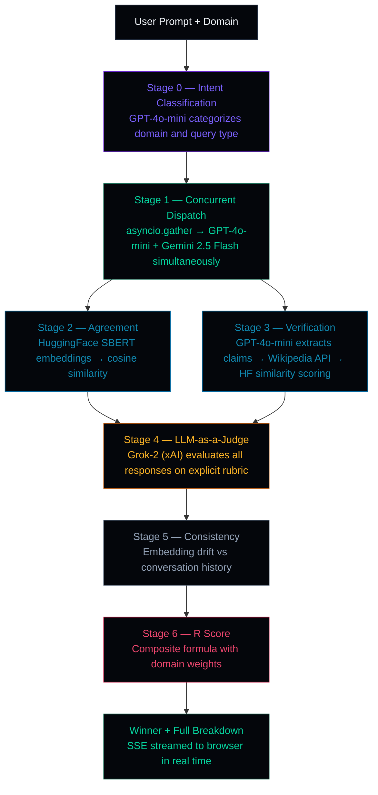
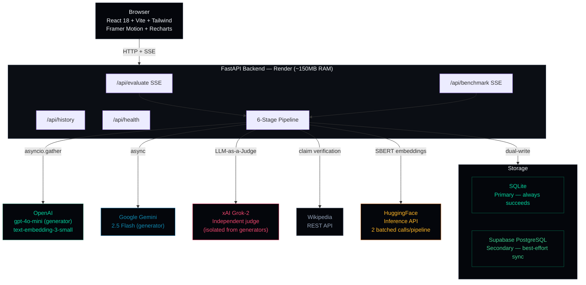

<div align="center">

<br/>

<h1>CleverPick</h1>

### LLM Reliability Evaluation Platform

*Because knowing which AI to trust matters.*

<br/>

[](https://fastapi.tiangolo.com)&nbsp;
[](https://python.org)&nbsp;
[](https://react.dev)&nbsp;
[](https://vitejs.dev)&nbsp;
[](https://supabase.com)&nbsp;
[](https://developer.mozilla.org/en-US/docs/Web/API/Server-sent_events)&nbsp;
[](https://vercel.com)&nbsp;
[](https://render.com)

<br/>

| Component | Status |
|:----------|:------:|
| 6-Stage Evaluation Pipeline | `● Operational` |
| Concurrent LLM Dispatch | `● Operational` |
| LLM-as-a-Judge Scoring | `● Operational` |
| Wikipedia Fact Verification | `● Operational` |
| SSE Real-Time Streaming | `● Operational` |
| TruthfulQA Benchmark | `● Operational` |

<br/>

[How It Works](#the-problem) &nbsp;·&nbsp; [R Score](#the-r-score) &nbsp;·&nbsp; [Pipeline](#evaluation-pipeline) &nbsp;·&nbsp; [Architecture](#system-architecture) &nbsp;·&nbsp; [Run It](#local-development)

<br/>

</div>

---

<br/>

## The Problem

AI models hallucinate. They sound confident whether they are right or wrong. A single model's self-assessment is worthless — the model that fabricated a claim will give that claim a high confidence score too. Users have no principled way to know when to trust an AI response.

This is especially consequential for high-stakes queries: medical information, legal questions, research, technical decisions. A confident hallucination and a correct answer look identical to the user.

## The Solution

CleverPick treats reliability as a **multi-signal, multi-model problem**. It dispatches a query to two independent AI models simultaneously, then runs a 6-stage automated pipeline that scores each response across four orthogonal dimensions — agreement, verification, evaluation, and consistency — before selecting a winner and explaining exactly why.

The output is a single **R Score** (0–1) with full transparency into how it was computed.

<br/>

## The R Score

The R Score is a composite reliability metric built from four independently computed dimensions, weighted by domain.

<div align="center">

| Symbol | Dimension | What It Measures | Weight (Medical) | Weight (Code) | Weight (Research) |
|:------:|:----------|:-----------------|:----------------:|:-------------:|:-----------------:|
| **A** | Agreement | Semantic similarity between GPT and Gemini responses | 20% | 20% | 40% |
| **V** | Verification | Factual claims confirmed by Wikipedia | 45% | 15% | 30% |
| **E** | Evaluation | Grok-2 judge score — accuracy, relevance, completeness, clarity | 25% | 40% | 20% |
| **C** | Consistency | Alignment with prior conversation turns | 10% | 25% | 10% |

</div>

```
R = w_A × A  +  w_V × V  +  w_E × E  +  w_C × C
```

**Why domain-specific weights:** A medical query and a code query are not the same problem. Medical responses demand rigorous fact verification — errors cause harm, so V carries 45% weight. Code responses don't need Wikipedia-verifiable facts — quality and structure matter, so E carries 40%. Research queries value cross-model consensus — agreement carries 40%. The weight system encodes domain expertise directly into the scoring formula.

**Why composite scoring:** No single signal is definitive. Agreement alone misses cases where both models are wrong about the same thing. Verification alone fails on cutting-edge topics. The composite score is more robust than any individual metric.

<br/>

## Evaluation Pipeline



**SSE streaming:** Every stage transition emits a Server-Sent Event. The browser renders a live 6-stage progress stepper as the pipeline executes — no blank screen during the 15-second evaluation window.

<br/>

## Why These Design Decisions

<div align="center">

| Decision | Reasoning |
|:---------|:----------|
| **Two generators, not one** | A single model cannot reliably judge its own output — self-assessment is circular. Two independent models from different providers produce genuinely independent perspectives. |
| **Grok-2 (xAI) as judge, isolated from generators** | Grok-2 is architecturally separated from the generator pool (GPT-4o-mini + Gemini). Same-model judging introduces self-preference bias — systematic inflation of its own outputs. The generator/judge wall is the core fairness guarantee of the R Score. |
| **Wikipedia for verification** | Free, programmatically stable, peer-reviewed for mainstream factual claims. Its limitations are acknowledged — V scores on cutting-edge or highly specialized topics should be interpreted with caution. |
| **SSE over WebSockets** | The pipeline is unidirectional — the server pushes progress events, the client never sends messages mid-stream. SSE is simpler, runs over standard HTTP, works through proxies, and auto-reconnects natively. |
| **SQLite primary + Supabase secondary** | Pure Supabase dependency creates fragility: network unavailability, expired keys, missing tables. SQLite always succeeds and keeps data local. The dual-write pattern means CleverPick works fully offline and syncs to cloud when possible. |
| **HuggingFace API for embeddings, not local PyTorch** | Local PyTorch on Render's free tier consumes ~400MB RAM, leaving 112MB headroom. HuggingFace Inference API keeps the server at ~150MB. All embeddings are batched into 2 API calls per pipeline run — one for agreement, one for verification similarity — instead of 15+ individual calls, keeping rate limits and latency under control. |
| **`json_mode=True` for structured LLM calls** | Without enforced JSON mode, models return markdown-wrapped JSON with preamble text — causing `JSONDecodeError` crashes. Groq's `response_format: json_object` guarantees raw parsable output. |
| **`tenacity` retry on HuggingFace calls** | HuggingFace Inference API rate-limits at 429. Exponential backoff with `tenacity` handles these automatically — without it, embeddings fail silently under moderate load. |
| **Hallucinated claims score 0.25, not 0.5** | A not-found claim should be penalized, not treated as neutral. Scoring 0.5 for unverifiable claims would make hallucination cost-free — 0.25 ensures fabricated facts actively reduce the V score. |

</div>

<br/>

## System Architecture



<br/>

## Failure Recovery

<div align="center">

| Failure Mode | Recovery Behavior |
|:-------------|:------------------|
| OpenAI API unreachable | Benchmark falls back to Gemini-only; main pipeline runs Gemini-only with partial scores |
| HuggingFace 429 rate limit | `tenacity` exponential backoff — auto-retries up to 3 times before surfacing error |
| Groq returns malformed JSON | `json_mode=True` prevents this at the API level — guaranteed raw JSON output |
| Supabase unavailable | SQLite write succeeds regardless — Supabase failure is logged, non-fatal |
| Single model responds (A undefined) | Agreement score set to 0.0 — mathematically correct, flagged in response |
| Render cold start (spin-down) | cron-job.org pings `/api/health` every 14 minutes — server stays warm |
| Context window exceeded | Conversation history truncated to last 5 turns before embedding |

</div>

<br/>

## Production Readiness

<div align="center">

| Subsystem | Status | Detail |
|:----------|:------:|:-------|
| Concurrent async dispatch | ✅ Hardened | `asyncio.gather` — GPT-4o-mini + Gemini called simultaneously, not sequentially |
| Generator/judge isolation | ✅ Hardened | Grok-2 judges; GPT-4o-mini and Gemini generate — never the same model for both roles |
| HF embedding efficiency | ✅ Hardened | 2 batched API calls per pipeline, not 15 individual calls — rate limit safe |
| JSON parsing stability | ✅ Hardened | `response_format: json_object` enforced on all structured LLM calls |
| Rate limit resilience | ✅ Hardened | `tenacity` exponential backoff on all HuggingFace calls |
| Hallucination penalty | ✅ Hardened | Unverified claims score 0.25 — fabricated facts actively reduce V score |
| Real-time streaming | ✅ Hardened | SSE streams every stage transition — no blank screen during evaluation |
| Storage redundancy | ✅ Hardened | SQLite primary always succeeds; Supabase secondary best-effort sync |

</div>

<br/>

## Production Deployment

<div align="center">

| Concern | Solution | Result |
|:--------|:---------|:-------|
| Render OOM (512MB limit) | No PyTorch, no spaCy — embeddings via HF API | Server runs at ~150MB |
| Data loss on spin-down | SQLite primary + Supabase secondary dual-write | Zero data loss |
| 15-second blank screen | SSE streams stage-by-stage progress events | User watches pipeline execute |
| CORS errors | FastAPI CORS middleware locked to Vercel domain | Clean cross-origin |
| Render cold start | cron-job.org 14-min keep-alive ping | Always warm |
| Frontend serverless timeouts | Vite static SPA on Vercel — no serverless functions | Zero timeout risk |

</div>

| Service | Free Tier | Usage Per Query | Daily Budget (50 queries) |
|:--------|:----------|:----------------|:-------------------------:|
| Groq | 14,400 req/day | ~5 calls | 250 — safe |
| Gemini | 1,500 req/day | 1 call | 50 — safe |
| HuggingFace | Rate-limited | 2 batched calls | 100 — safe |
| Wikipedia | Unlimited | 3–5 per claim | Unlimited |
| Supabase | 500MB storage | 1 write | Unlimited |
| Vercel + Render | Free tier | Static + 750 hrs/mo | Free |

<br/>

## Tech Stack

<div align="center">

**Backend**

| Technology | Version | Role |
|:-----------|:-------:|:-----|
| FastAPI | 0.115.0 | REST API + SSE endpoints |
| Python | 3.13+ | Runtime |
| httpx | latest | Async HTTP client for all external APIs |
| scikit-learn + numpy | latest | Cosine similarity for embedding comparison |
| tenacity | 8.5.0 | Exponential backoff retry for HF API calls |
| sse-starlette | 2.1.0 | Server-Sent Events streaming |
| SQLite | stdlib | Primary local persistence |
| supabase-py | 2.9.0 | Secondary cloud persistence |

**Frontend**

| Technology | Version | Role |
|:-----------|:-------:|:-----|
| React | 18.3.1 | Component model |
| Vite | 5.4.2 | Build tool and HMR dev server |
| Tailwind CSS | 3.4.10 | Utility-first styling |
| Framer Motion | 11.3.0 | Page transitions, gauge animations, SSE reveal |
| Recharts | 2.12.7 | Dashboard bar charts, heatmap, line charts |
| React Router DOM | 6.26.0 | Client-side SPA routing |
| React Markdown | 10.1.0 | Render model responses as formatted markdown |

</div>

<br/>

## Project Statistics

<div align="center">

| Metric | Value |
|:-------|:-----:|
| Pipeline stages | 6 (+ 2 concurrent sub-stages) |
| Active generator models | 2 (GPT-4o-mini + Gemini 2.5 Flash) |
| Judge model | Grok-2 (xAI — isolated from generators) |
| Embedding model | text-embedding-3-small (1536-dim) |
| Supported domains | 7 |
| External APIs | 5 (OpenAI · Gemini · Grok/xAI · HuggingFace · Wikipedia) |
| Database layers | 2 (SQLite primary · Supabase secondary) |
| Benchmark dataset | 50 TruthfulQA questions |
| Backend modules | ~20 Python files |
| Frontend modules | ~24 JSX/JS files |
| API endpoints | 6 |
| Runtime RAM (Render) | ~150MB |
| Typical evaluation time | ~15 seconds end-to-end |

</div>

<br/>

## Local Development

### Prerequisites

- Python 3.13+
- Node.js 18+
- API keys: OpenAI, Google Gemini, xAI (Grok), HuggingFace, Supabase

### Backend

```bash
cd backend
pip install -r requirements.txt

# Create .env:
# OPENAI_API_KEY=sk-...
# GEMINI_API_KEY=...
# XAI_API_KEY=xai-...
# HF_TOKEN=hf_...
# SUPABASE_URL=https://your-project.supabase.co
# SUPABASE_ANON_KEY=...

python start.py
# → http://localhost:8000
```

Verify: `curl http://localhost:8000/api/health`

### Frontend

```bash
cd frontend
npm install

# Create frontend/.env:
# VITE_API_URL=http://localhost:8000

npm run dev
# → http://localhost:5173
```

### Local URLs

| Service | URL |
|:--------|:----|
| Frontend | http://localhost:5173 |
| Backend | http://localhost:8000 |
| Health check | http://localhost:8000/api/health |
| Dashboard data | http://localhost:8000/api/dashboard |
| History | http://localhost:8000/api/history |

<br/>

## Known Limitations

<div align="center">

| Limitation | Impact |
|:-----------|:-------|
| Wikipedia coverage | V scores are unreliable for cutting-edge, niche, or highly specialized topics |
| Single-model agreement | When only one model responds, A=0.0 — agreement is mathematically undefined for one model |
| No authentication | API endpoints are open — suitable for local or trusted network use only |
| Frontend-only history | Conversation history lives in browser memory — page refresh clears it |
| Benchmark is lightweight | Uses generation + V-score only; skips Agreement, Evaluation, Consistency to conserve API credits |
| Embedding model fixed | `text-embedding-3-small` is hardcoded — not configurable without code changes |

</div>

<br/>

## Project Structure

<details>
<summary>View full directory tree</summary>

```
CleverPick/
│
├── backend/
│   ├── main.py                    # FastAPI app, CORS, lifespan
│   ├── start.py                   # Uvicorn entry point
│   ├── requirements.txt
│   ├── .env.example
│   │
│   ├── routers/
│   │   ├── evaluate.py            # POST /api/evaluate (SSE)
│   │   ├── history.py             # GET /api/history
│   │   ├── benchmark.py           # POST /api/benchmark (SSE)
│   │   └── health.py              # GET /api/health
│   │
│   ├── pipeline/
│   │   ├── intent.py              # Stage 0: domain + query classification
│   │   ├── dispatcher.py          # Stage 1: asyncio.gather concurrent dispatch
│   │   ├── agreement.py           # Stage 2: HF embeddings + cosine similarity
│   │   ├── verification.py        # Stage 3: claim extraction + Wikipedia + HF
│   │   ├── evaluator.py           # Stage 4: Grok-2 judge (JSON mode + rubric)
│   │   ├── consistency.py         # Stage 5: embedding drift vs history
│   │   └── scorer.py              # Stage 6: composite R score
│   │
│   ├── services/
│   │   ├── openai_client.py
│   │   ├── gemini_client.py
│   │   ├── xai_client.py          # Grok-2 judge (JSON mode)
│   │   ├── hf_embeddings.py       # tenacity retry wrapper
│   │   ├── wikipedia_client.py
│   │   └── supabase_client.py
│   │
│   ├── models/
│   │   └── schemas.py             # Pydantic request/response models
│   │
│   └── data/
│       └── truthfulqa_50.json     # 50 curated benchmark questions
│
└── frontend/src/
    ├── components/
    │   ├── ScoreGauge.jsx         # Animated SVG arc gauge
    │   ├── PipelineProgress.jsx   # 6-dot SSE-driven stepper
    │   ├── WinnerReveal.jsx       # Animated best-response panel
    │   ├── ClaimRow.jsx           # Claim verification status
    │   ├── ScoreBreakdown.jsx     # A · V · E · C four-card grid
    │   └── HeatmapGrid.jsx        # Agreement matrix (Recharts)
    │
    ├── pages/
    │   ├── ChatPage.jsx           # Main evaluation interface
    │   ├── DashboardPage.jsx      # Leaderboard + analytics
    │   ├── BenchmarkPage.jsx      # TruthfulQA runner
    │   ├── HistoryPage.jsx        # Search + filter past evaluations
    │   └── SettingsPage.jsx       # Weight sliders + model toggles
    │
    └── hooks/
        ├── useSSE.js              # SSE consumer (progress + result)
        └── useToast.js
```

</details>

<br/>

---

<div align="center">

<br/>


*CleverPick — because knowing which AI to trust matters.*

<br/>


<br/>

</div>
